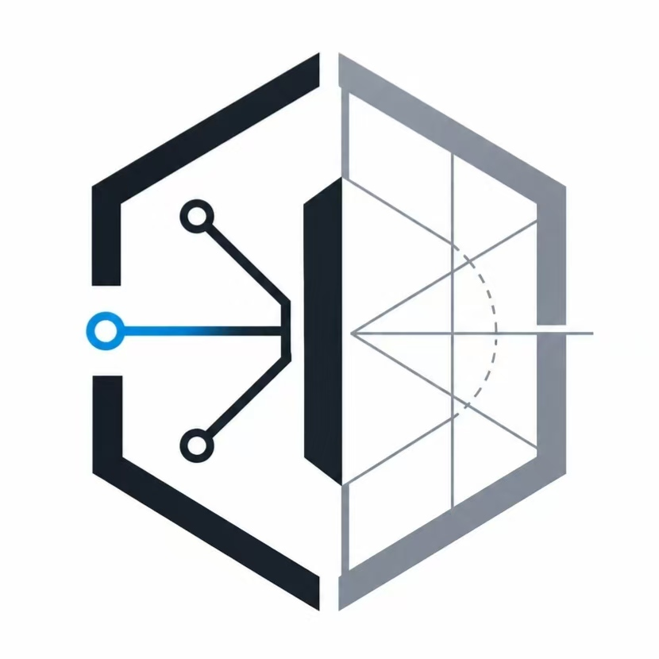

# DWG-Agent 企业 CAD 处理平台



[简体中文](README.md) | [English](README_EN.md)

**交付级别：v0.1 技术预览版。当前文档基线：2026-07-21。** 该级别面向技术人员试用与继续开发，不代表生产就绪。运行事实以当前代码、迁移、配置和[验证证据](docs/verification/current.md)为准；[开发指南](docs/guides/development.md)给出首次安装和验收路径，[实现状态](docs/architecture/implementation-status.md)记录证据与剩余风险，[企业平台技术规范](docs/architecture/platform-specification.md)给出规范性边界。仓库只维护中文项目文档。

> [!IMPORTANT]
> 本 README 只描述仓库当前实现，不把占位目录、关闭的功能开关或尚未配置的基础设施写成已交付能力。详细项目文档仅维护[中文版本](docs/README.md)，英文 README 用于提供项目概览。

## 🧭 分层阅读

根据你的目标选择入口：

| 你想了解什么 | 建议阅读 |
|---|---|
| 项目能做什么、不能做什么 | [平台状态](#-平台状态) → [范围边界](#-范围边界) |
| 系统如何部署和通信 | [系统架构](#️-系统架构) → [本地启动](#-本地启动) |
| 哪些处理管线可以启用 | [处理能力](#-处理能力) → [工作流与启用边界](docs/architecture/workflow.md) |
| 如何开发和验证 | [开发与验证](#-开发与验证) → [开发文档](docs/guides/development.md) |
| 如何部署和运维 | [Compose 部署](#compose-部署) → [部署文档](docs/guides/deployment.md) → [运维文档](docs/guides/operations.md) |

状态标记：**✅ 已实现** · **⚠️ 有条件可用** · **⏸️ 默认关闭/占位** · **❌ 不在当前交付范围**

## 🚦 平台状态

### 核心能力

| 领域 | 状态 | 当前实现 | 关键边界 |
|---|---|---|---|
| Web 与 API | ✅ | React 管理端、Nginx 网关、133 个 OpenAPI path 和 156 个 operation | 生产配置关闭 `/docs`、`/redoc`、`/openapi.json`；Nginx 不是授权边界 |
| 数据 | ✅ | MySQL 8.x 是唯一运行时业务事实源；Alembic 管理 42 张模型表，Celery 按需创建 8 张 broker/result 表 | 空迁移库为 43 张表；Celery runtime 全部初始化后最多 51 张；SQLite 只用于 pytest |
| 异步任务 | ✅ | Celery 使用 MySQL SQLAlchemy transport 和 MySQL result backend | 适合当前有界 worker 拓扑，不等同于高吞吐消息队列 |
| 运行与通信 | ✅ | MySQL 持久化 Worker 活动、控制平面事件与管理员运维消息 | RabbitMQ、Beat、Outbox 与 Windows Node Agent 为明确待实现合同 |
| 存储 | ✅ | Local/MinIO 清单、流转账本、异步一致性扫描、DXF 预览生命周期和四类安全处置 | MySQL 保存登记，存储层保存字节；跨系统使用 saga/补偿，不宣称单一 ACID |
| 数据控制台 | ✅ | 总览、文件登记、存储对象、入出库流水、每日归档、一致性、运行通信七页签 | 管理员可归档/扫描/处置，审计员只读/预检；归档不改源文件，永久清理不可恢复且必须确认 |
| Excel Final 控制台 | ✅ | 权限过滤精确总览、任务监视、跨批次检索、比重查询、批次/零件/构件分页、结果预览和 URL 状态恢复 | 上传/建任务使用数据库级幂等键；健康栏显示实际数据库/存储后端；管线关闭时历史数据仍可浏览 |

### 编排与扩展能力

| 领域 | 状态 | 当前实现 | 关键边界 |
|---|---|---|---|
| Linux 生产工作流 | ⚠️ | 多 DWG + 单 Excel 输入账本、服务器 DWG→DXF/配对/冻结、Steel DXF Classifier 1.1.0 分类分流、十阶段、DXF→Excel/Excel Final Job、attempt 同步和生产流程控制台 | 图纸拆板、CAM 工作包、Windows/SinoCAM、结果接纳为显式留白接口；处理管线由开关控制 |
| 转换管线 | ⚠️ | report、DWG → DXF、DXF → DWG、DXF → Excel、Excel Final 服务路径；DXF 鉴权 SVG 预览 | 四条业务管线默认关闭，分别受 ODA、Stage 完整性和手册库约束；在线预览有独立大小/复杂度上限 |
| Agent | ⏸️ | 三张 MySQL 表、会话记忆、API/权限和机器可读能力契约已归 `automation` | 核心执行留白；无 Agent task、LLM/LangGraph/MCP 执行器，`AGENT_ENABLED=false` |
| Windows CAD worker | ⏸️ | Node/CAM/协议目录和 draft 控制面合同保留 | 节点认证、租约/fencing、拆板、左右进、交互式 CAD、CAM Runner/SinoCAM Adapter 未实现；已交付的 Steel DXF 分类属于 Linux 流程 |
| Redis/Valkey | ❌ | 当前运行时不使用 | 业务状态、SSE、token 吊销、Agent memory、broker/result 均直接使用 MySQL |

## 🏗️ 系统架构

### 实际拓扑

```text
Browser
  -> Nginx
     -> React SPA
     -> FastAPI
        -> MySQL (业务数据 + Celery broker/result 表)
        -> Local FS 或 MinIO
Celery workers（无入站监听端口）
  -> MySQL:3306 领取消息并条件更新 Job/JobStep
  -> Local FS 或 MinIO 读取源文件、写入结果
  -> 独立 Stage / ODA 子进程
```

### 端口与网络

| 模式 | 用户入口 | FastAPI | MySQL / MinIO |
|---|---|---|---|
| 本地开发 | Vite `127.0.0.1:5173` 或 Nginx `127.0.0.1:8080` | `127.0.0.1:8010` | MySQL `127.0.0.1:3306`；MinIO 可选 |
| Compose | Nginx 宿主 HTTP `:80` → 容器 `:8080` | 仅内部 `backend-api:8010` | 仅 `internal` 网络，不发布宿主端口 |

> [!WARNING]
> 当前 Compose 仅发布 HTTP，默认把宿主 `${HTTP_PORT:-80}` 映射到 Nginx 容器 `8080`，**不发布 443，也不提供 TLS**。公网部署前必须在受控入口补齐证书、HTTPS 跳转、HSTS、续期和真实浏览器/握手验证；不能把网络隔离或安全响应头等同于传输加密。

## 🧩 处理能力

### 管线矩阵

| 管线 / 队列 | 状态 | 默认开关 | 运行前提 |
|---|---|---|---|
| framework smoke / `report` | ✅ 可运行的框架任务 | 核心 worker 默认启动 | MySQL broker/result 与存储可用；不代表报告 Agent 已实现 |
| DWG → DXF / `dxf` | ⚠️ 服务、task、测试和 ODA 适配存在 | `DXF_PIPELINE_ENABLED=false` | ODA File Converter、无头 X 环境、源 DWG 校验通过 |
| DXF → DWG / `dxf2dwg` | ⚠️ 服务、task、测试和 ODA 适配存在 | `DXF2DWG_PIPELINE_ENABLED=false` | 同上，并要求有效 DXF |
| DXF → Excel / `dxf2excel` | ⚠️ Stage 源码、平台 service/task 和测试已纳入父仓库 | `DXF2EXCEL_PIPELINE_ENABLED=false` | 有效 DXF、Stage 锁定依赖；当前内置单测只覆盖解码，真实批次仍需外部 corpus 验收 |
| Steel DXF 分类 / `dxf_classification` | ⚠️ Classifier 1.1.0、Job/Workflow 编排、两张账本表及 DXF/JSON/CSV 双登记已接通 | `DXF_CLASSIFICATION_PIPELINE_ENABLED=false` | 需要冻结的服务器派生 DXF 与代表性业务样本；分类不等于自动拆板 |
| Excel Final / `excel_final` | ⚠️ backend 适配、隔离子进程、关系化导入和 Stage 测试存在 | `EXCEL_FINAL_PIPELINE_ENABLED=false` | 有效 Tekla/初始表 schema、`hardware_handbook` 只读库、足够超时 |
| Agent / `agent` | ⏸️ API/持久化与队列名保留，没有注册 Celery task | `AGENT_ENABLED=false` | 缺少真实执行器；运行一个空闲 queue worker 也不代表能力可用 |
| Windows / `cad` | ⏸️ `windows/` 按 Node Agent/CAM Runner/Adapter/协议保留外部合同，没有注册 Celery task | `CAD_WORKER_ENABLED=false` | 尚未满足交付条件；Compose 没有 `worker-cad` |

### 任务一致性

任务以 `(job_id, attempt)` 作为执行世代。重试递增 `attempt`；worker 的领取、进度和终态更新都必须匹配当前状态与 attempt，从而阻止旧消息或旧 worker 覆盖新一轮任务。SSE 轮询 MySQL 并发送当前 attempt 的权威快照，不提供按 event ID 的历史回放。

### 工作流边界

工作流以 `workflow_runs → workflow_stage_runs → workflow_artifacts` 统筹业务阶段和产物引用。`linux_production` 覆盖输入冻结、图纸交接、Excel 两阶段、CAM/Windows 交接、结果接纳和归档；`excel_stage1` 与 `excel_final` 已直接复用现有 Job/Celery 管线，详情同步成功结果并自动挂接 File/AnalysisResult。

这仍不是 SinoCAM 完整生产闭环：图纸拆板、CAM 工作包、Windows Node Agent/SinoCAM 与结果接纳返回 `WORKFLOW_STAGE_NOT_IMPLEMENTED`，同时暴露输入输出契约；操作员绑定外部交接产物后才可确认推进。详见[Linux 生产工作流框架](docs/architecture/workflow.md)。

## 🎯 范围边界

### 当前继续完善

- 项目、文件与格式转换；
- Excel Final 与通用流程；
- 任务、复核、权限与审计；
- 部署和运维框架。
- 非破坏式每日归档：预检冻结清单、维护队列生成 ZIP/manifest、MySQL 与对象存储双登记。

### 不在当前交付范围

- CAD 图纸构件提取、自动/交互拆板和左右进业务算法（Steel DXF 预处理与分类分流已经实现，不在此列）；
- 中望 CAD 二次开发及 Windows CAD Worker；
- Agent 执行、模型调用、MCP 工具编排和已交付会话 memory 的产品化编排。

仓库只保留真实 route/model/config 与机器可读 capability 合同；误导性的空 task/client/adapter 已删除。合同存在只表示接口留白，不表示核心能力已经实现。

## ⚠️ 已知限制

1. Compose 当前仅提供 HTTP 且不发布 `443`；TLS 入口、证书生命周期和 HTTPS 验证尚未实现。
2. 备份、保留策略、监控告警、集中日志和灾难恢复演练尚未自动化；文档中的相关步骤是操作基线，不是已部署服务。
3. MySQL SQL transport 缺少 RabbitMQ 一类 broker 的吞吐、路由和远程控制能力。扩容 broker 时仍应保留 MySQL 作为业务事实源。
4. ODA 转换依赖专有二进制及其许可/运行环境；单元测试通过不等于所有真实 DWG/DXF 版本均兼容。
5. 仓库尚未声明 LICENSE；在项目负责人确认授权、第三方许可和样本数据分发范围前，只能作为内部技术预览使用，不得推定为开源或可对外再分发。

## 🚀 本地启动

### 前置条件

- Python 3.12 与 `uv`；
- Node.js 与 npm；
- MySQL 8.x；
- 与启用管线匹配的 Stage 依赖。

### 启动开发环境

```bash
cp .env.example .env
cp .env.example backend/.env
# 替换密码和 JWT secret；两份文件的 MYSQL_* 必须一致。

bash scripts/db.sh setup-user
bash scripts/db.sh init
bash scripts/start-dev.sh
```

`start-dev.sh` 启动 8 组本地 worker：`report`、`dxf_classification`、`dxf`、`dxf2dwg`、`dxf2excel`、`excel_final`、`dispatch`、`maintenance`（不启动 `agent/cad`），并启动 FastAPI `8010` 和 Vite。`start-all.sh` 还会构建前端并启动本地 Nginx `8080`。`dispatch` 当前是可观察的队列身份预留；功能开关关闭时 worker 可以存活，但对应 API 会拒绝创建任务。

需要复用容器内 MySQL/MinIO 并热更新 API 时，可运行：

```bash
docker compose -f compose.yaml -f compose.dev.yaml --profile workers up --build
```

开发覆盖只把 `127.0.0.1:8010` 发布到宿主，不发布 MySQL/MinIO。

### 常用管理命令

```bash
bash scripts/status.sh
bash scripts/stop-all.sh
bash scripts/db.sh status
```

### Compose 部署

在接受当前仅 HTTP、内部技术预览和外部 Stage 依赖边界后：

```bash
cp .env.docker.example .env.docker
# 替换全部 CHANGE_ME_*，不要提交 .env.docker。
npm --prefix frontend ci
npm --prefix frontend run build

docker compose config --quiet
docker compose up -d
docker compose --profile workers up -d
docker compose ps
```

核心集合为 `nginx/backend-api/mysql/minio/worker-report`；`workers` profile 增加 5 组 CAD/Excel worker、`dispatch`、`maintenance` 和 contract-only `worker-agent`，Compose 总计 13 个服务。`worker-agent` healthy 只表示 Celery 进程已连接 broker；当前没有注册 Agent task，也没有 Agent 执行器。

## 🧪 开发与验证

### 文档、静态检查与后端测试

```bash
make docs-check
cd backend
uv run ruff check app tests ../tests/run_full_verify.py
uv run pytest -q
uv run alembic check
cd ..
```

### Stage、数据库与基础设施契约

```bash
cd Stages/dwg2dxf && uv run pytest -q && cd ../..
cd Stages/dxf2dwg && uv run pytest -q && cd ../..
cd Stages/dxf2excel && uv run pytest -q && cd ../..
cd Stages/excel_final && uv run pytest -q multi_split/tests && cd ../..
bash scripts/db.sh migration-test
bash infra/verification/verify.sh
docker compose config --quiet
```

### 前端构建与浏览器测试

```bash
cd frontend
npm run build
npx playwright test
```

测试层级不能互相替代：SQLite pytest 验证业务逻辑，`migration-test` 验证空 MySQL schema，`infra/verification/verify.sh` 验证静态与活动基础设施契约，Playwright 验证浏览器交互。

完整发布验收还必须使用真实 MySQL、Celery、MinIO 和有效样本，完成上传、处理、重试、SSE、签名下载、存储中断与恢复闭环。详见[当前验证证据](docs/verification/current.md)。

## 🗂️ 仓库结构

```text
backend/        FastAPI、SQLAlchemy、Alembic、Celery、存储适配与 pytest
frontend/       React 管理端、API client 与 Playwright
Stages/         独立 CAD/Excel 处理阶段；Python Stage 源码已跟踪，外部二进制/corpus 另行管理
agents/         未交付的 Agent 目录占位
windows/        Node Agent、CAM Runner、SinoCAM Adapter 与协议留白
infra/          网关、数据库、存储、消息目标、运维与验证
scripts/        本地启停、数据库与文档工具
docs/           唯一维护的中文详细文档
third_parts/    外部/上游项目；不代表平台直接交付的能力
```

## 📚 文档导航

| 分类 | 文档 |
|---|---|
| 总览 | [实现状态](docs/architecture/implementation-status.md) · [验证证据](docs/verification/current.md) · [文档索引](docs/README.md) · [贡献指南](CONTRIBUTING.md) · [变更记录](CHANGELOG.md) |
| 规范 | [企业平台技术规范](docs/architecture/platform-specification.md) |
| 设计 | [架构](docs/architecture/overview.md) · [数据库](docs/reference/database.md) · [Linux 生产工作流](docs/architecture/workflow.md) |
| 开发 | [开发指南](docs/guides/development.md) · [API](docs/reference/api.md) · [配置参考](docs/reference/configuration.md) |
| 管线 | [工作流与处理边界](docs/architecture/workflow.md) · [当前验证证据](docs/verification/current.md) |
| 交付 | [部署](docs/guides/deployment.md) · [运维](docs/guides/operations.md) · [安全](docs/guides/security.md) · [实现差距](docs/architecture/implementation-status.md) |

路由变更后运行 `make docs-generate` 生成 `docs/reference/api.md`；提交前运行 `make docs-check`。
