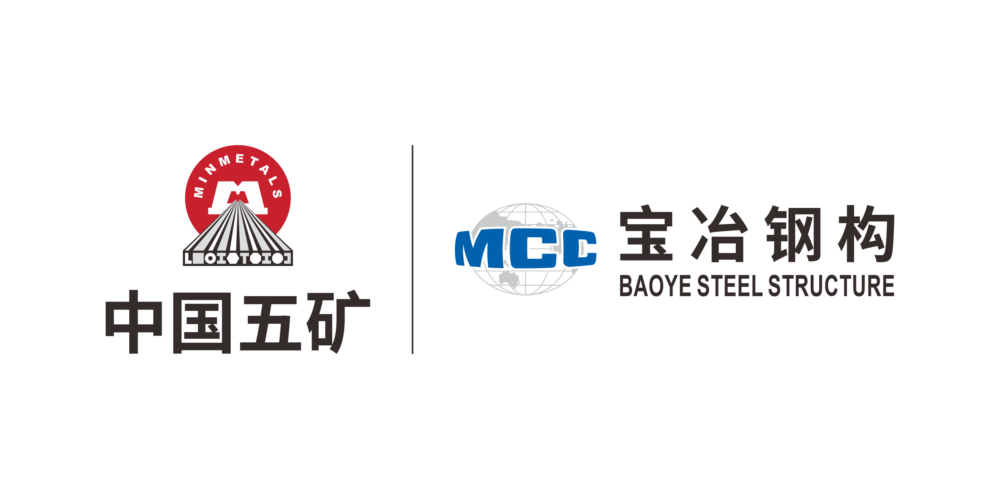

# DWG-Agent Enterprise CAD Processing Platform

<div align="center">



[简体中文](README.md) ｜ [English](README_EN.md)

**Delivery tier:** `v0.1 technical preview` — intended for technical evaluation and continued development; it does not represent production readiness

</div>

> [!IMPORTANT]
> This README describes only what is present in the repository today. Placeholder directories, disabled feature flags, and unconfigured infrastructure are not presented as delivered capabilities. Runtime facts are governed by the current code, migrations, configuration, and [verification evidence](docs/verification/current.md). Detailed project documentation is maintained **in Chinese only** under [docs/](docs/README.md); this English README provides a project-level overview.

## 🎯 Project Overview

DWG-Agent is an **enterprise-grade CAD drawing processing platform for steel-structure detailing and fabrication**. Built around server-side automation pipelines, it turns the highly repetitive manual work of steel fabrication — drawing format conversion, automatic part classification, automatic plate splitting, layout computation, and hardware-handbook lookup — into **traceable, reviewable, and auditable** standardized processes.

For fabrication shops that struggle with heterogeneous drawing sources, inconsistent formats, hard-to-manage batches, and error-prone manual processing, DWG-Agent delivers an end-to-end loop from **drawing intake → format conversion → automatic classification → plate splitting → layout computation → result delivery**:

- **Unified intake ledger**: multiple DWGs plus exactly one business Excel are managed as a "production batch + input freeze"; every source file is archived and the manifest hash is pinned, so inputs cannot drift during processing;
- **Deterministic processing pipelines**: server-side DWG→DXF conversion, Steel DXF Classifier routing, Steel DXF Split batch execution, and Excel Final layout/handbook processing — each stage is a versioned, independently testable deterministic Stage;
- **Strict execution semantics**: execution generations are identified by `(job_id, attempt)`, so stale messages or workers can never overwrite a newer run; file registration, transfer, and disposal are all recorded in the MySQL ledger for end-to-end audit;
- **Layered governance and permissions**: the web console, data console, job state machine, and RBAC work together — administrators act only through the job state machine and registered-file rules, and every write enters the audit log.

> [!NOTE]
> The current delivery tier is `v0.1 technical preview`. The conversion, classification, splitting, and Excel processing vertical slices are runnable and backed by regression evidence; Agent execution, the Windows CAD Worker, SinoCAM integration, and production-grade TLS remain explicit gaps. The authoritative capability list is [implementation status](docs/architecture/implementation-status.md) and [verification evidence](docs/verification/current.md).

## ✨ Key Features

| Feature | Description |
|---|---|
| 🔄 Server-side format conversion | Bidirectional DWG→DXF and DXF→DWG conversion with original file names preserved, plus authenticated SVG preview and result download |
| 🗂️ Automatic classification and splitting | Steel DXF Classifier 1.2.0 routing; Steel DXF Split 1.5.2 batch execution with independent validation (BH/BOX, including geometry safety proofs). Splitting is disabled by default in production and requires real business-sample acceptance |
| 📊 Excel layout processing | Excel Final stage: workbook normalization, batch/part/component modeling, exact hardware-handbook lookup, and final workbook generation |
| 🔒 Input freeze and file ledger | Production-batch input freeze (multiple DWGs + one Excel with pinned manifest hash); file registration, transfer, and disposal tracked end to end in the MySQL ledger with auditing |
| ⚙️ Ten-stage workflow orchestration | `workflow_runs → workflow_stage_runs → workflow_artifacts` coordinate business stages; attempt generations prevent stale messages from overwriting newer runs |
| 🖥️ Admin console and data console | React admin UI plus production-job and file-storage workspaces, with RBAC, audit logs, and SSE job monitoring |
| 📦 Streaming delivery and physical release | Four file kinds exported in streamed batches; objects are deleted only after the server confirms the download stream finished and the user confirms again — no server-side temporary ZIPs |

## 🧰 Technology Stack

| Layer | Technology |
|---|---|
| Frontend | React 19 · TypeScript · Vite · axios (Playwright end-to-end tests) |
| Backend | Python 3.12 · FastAPI · SQLAlchemy 2.x · Alembic · Celery 5.x · Pydantic |
| Data | MySQL 8.x (the only runtime source of business truth; also the Celery broker/result store) |
| Gateway and deployment | Nginx · Docker Compose |
| Storage | Local FS / MinIO (bytes live in object storage; MySQL holds registrations) |
| Processing Stages | ODA (DWG↔DXF) · Steel DXF Classifier · Steel DXF Split · Excel Final |
| Quality verification | pytest · Playwright · empty-schema migration tests · infrastructure contract verification (`infra/verification/verify.sh`) |

## 🧭 Layered Guide

| What do you want to know | Suggested path |
|---|---|
| 🏢 What the platform can and cannot do | [Platform Overview](#-platform-overview) → [Scope Boundaries](#-scope-boundaries) |
| 🏗️ How the system is deployed and communicates | [System Architecture](#️-system-architecture) → [Local Setup](#-local-setup) |
| 🧩 Which processing capabilities can be enabled | [Platform Overview](#-platform-overview) → [Workflow boundaries](docs/architecture/workflow.md) |
| 🚀 How to develop, validate, and release | [Development and Verification](#-development-and-verification) → [Development guide](docs/guides/development.md) |
| 📦 How to deploy and operate | [Compose Deployment](#compose-deployment) → [Deployment guide](docs/guides/deployment.md) → [Operations guide](docs/guides/operations.md) |

**Status markers:** ✅ Delivered · ⚠️ Conditionally available · ⏸️ Disabled/placeholder · ❌ Out of scope

## 📌 Current Snapshot

> Based on the current `main` branch (2026-08-12). This section records recent changes that are present in code and backed by regression evidence; it does not override the feature-flag, real-sample, or production-gate boundaries described below.

| Recent update | Current result | Notes |
|---|---|---|
| BOX drawing recognition | ⚠️ | Tekla SmartMerge merged drawings are supported, including 10 `w-1-cb` samples; all 10 new samples were auto-accepted, while the route and failure set for the existing 253-sample corpus remained unchanged. The production path is still gated by `DXF_SPLIT_PIPELINE_ENABLED` and real business-sample acceptance. |
| Geometry safety proofs | ✅ | Straight-column webs now require a length-consistency proof; suspected chamfer misreads route to manual review; the two webs remain separate physical plates; invalid geometry is skipped safely instead of being auto-published. |
| Workflow read path | ✅ | Workflow detail, classification, and splitting reads now synchronize only when Job or artifact drift is detected; steady-state reads no longer perform unconditional database writes. Classification statistics use database aggregation, and active frontend polling is less frequent. |
| Split ZIP downloads | ✅ | Fixed a render-effect interaction that could trigger `AbortController` and cancel a split-result ZIP request in the frontend; the server-side file remains available for retry after a failed download. |

These BOX recognition improvements expand the algorithm and Stage regression coverage; they do not mean every real drawing can automatically prove its allowance geometry. When a proof obligation is not satisfied, the system remains on the manual-review or failure path. See the [current verification evidence](docs/verification/current.md) and [Linux production workflow framework](docs/architecture/workflow.md).

## 🏢 Platform Overview

### Core Capabilities

| Area | Status | Current implementation | Boundary |
|---|---|---|---|
| Web and API | ✅ | React administration UI, Nginx gateway, 185 OpenAPI paths, and 213 operations | Production disables `/docs`, `/redoc`, and `/openapi.json`; Nginx is not an authorization boundary |
| Data | ✅ | MySQL 8.x is the only runtime source of business truth; Alembic manages 47 model tables, and Celery creates 8 broker/result tables on demand | A migrated empty database has 48 tables; up to 56 after all Celery runtime tables exist; SQLite is used only by pytest |
| Asynchronous jobs | ✅ | Celery uses the MySQL SQLAlchemy transport and MySQL result backend | Suitable for the current bounded worker topology; not equivalent to a high-throughput message broker |
| Runtime communication | ✅ | MySQL persists best-effort worker observations, control-plane events, and administrator messages | RabbitMQ, Beat, Outbox, and a Windows Node Agent remain explicit target contracts |
| Storage | ✅ | Local/MinIO inventory, transfer ledger, asynchronous consistency scans, DXF preview lifecycle, and four safe remediation actions | MySQL stores registrations and the storage layer stores bytes; cross-system changes use saga/compensation rather than a claimed single ACID transaction |
| Data console | ✅ | `/data-console` consolidates into two workspaces, production jobs and file storage; projects, stages, jobs, and storage areas all read existing business interfaces | No direct MySQL row editing; administrators act only through the job state machine and registered-file rules, while the backend keeps enforcing permissions and auditing |
| Excel Stage One workspace | ✅ | Four URL tabs for processing, batches, parts, and hardware handbook; structured input errors, job monitoring, batch details, exact handbook queries, and result preview | Production workflows consume the frozen Excel automatically; uploads/jobs at the standalone entry keep using database-level idempotency keys |

### Orchestration and Extension Capabilities

| Area | Status | Current implementation | Boundary |
|---|---|---|---|
| Linux production workflow | ⚠️ | Multiple-DWG + single-Excel intake ledger, server-side DWG→DXF pairing/freezing, Steel DXF Classifier 1.2.0 routing, Steel DXF Split 1.5.2 batch execution and independent validation, ten stages, frozen Excel Stage One and BH left/right Stage Two jobs, attempt synchronization, per-batch detail pages, and streaming four-file exports with post-download confirmed physical release | Splitting and Excel Stage Two still require real MinIO/MySQL, dedicated workers, and representative business-sample acceptance; batch exports create no server-side temporary ZIP, and objects are deleted only after the server confirms the download stream finished and the user confirms again; CAM packages, Windows/SinoCAM, and result acceptance remain waiting-for-launch interfaces |
| Conversion pipelines | ⚠️ | Standalone DWG → DXF and DXF → DWG workspaces with bidirectional original-name display, result downloads, and authenticated DXF SVG preview; service paths for DXF → Excel and Excel Final | The server template enables both CAD conversions; DXF → Excel remains disabled; online preview has independent size/complexity limits |
| Agent | ⏸️ | Three MySQL tables, bounded session memory, API/permission boundaries, and machine-readable capability contracts are grouped under `automation` | No Agent Celery task or LLM/LangGraph/MCP executor exists; `AGENT_ENABLED=false` |
| Windows CAD worker | ⏸️ | Node/CAM/protocol directories and a draft control-plane contract remain | Node authentication, leases/fencing, left/right feed, interactive CAD, CAM Runner, and SinoCAM Adapter are not implemented; Steel DXF classification and splitting are Linux workflow slices |
| Redis/Valkey | ❌ | Not part of the current runtime | Business state, SSE, token revocation, Agent memory, and Celery broker/results use MySQL directly |

## 🏗️ System Architecture

### Runtime Topology

```text
Browser
  -> Nginx
     -> React SPA
     -> FastAPI
        -> MySQL (business data + Celery broker/result tables)
        -> Local FS or MinIO
Celery workers (no inbound listening ports)
  -> MySQL:3306 to claim messages and conditionally update Job/JobStep
  -> Local FS or MinIO to read sources and write results
  -> Isolated Stage / ODA subprocesses
```

### Ports and Networking

| Mode | User entry point | FastAPI | MySQL / MinIO |
|---|---|---|---|
| Local development | Vite at `127.0.0.1:5173` or Nginx at `127.0.0.1:8080` | `127.0.0.1:8010` | MySQL at `127.0.0.1:3306`; MinIO is optional |
| Compose | Host HTTP `:80` → Nginx container `:8080` | Internal `backend-api:8010` only | Internal network only; no host ports are published |

> [!WARNING]
> The current Compose stack publishes **HTTP only**. It maps host `${HTTP_PORT:-80}` to Nginx container port `8080`; it does **not** publish port 443 or provide TLS. Before exposing the platform publicly, add certificates, HTTPS redirects, HSTS, renewal, and real browser/handshake verification at a controlled ingress. Network isolation and security headers are not substitutes for transport encryption.

### Workflow Boundary

The workflow layer coordinates business stages and artifact references via `workflow_runs → workflow_stage_runs → workflow_artifacts`. A new `linux_production` run uses definition revision 4: it accepts multiple DWGs and exactly one Excel, keeps every source DWG as evidence, and converts them to canonical DXFs; after freezing, drawings circulate only as classified/processed/CAM/accepted/delivery DXFs. `excel_stage1` reads the single `source_excel` from the frozen batch, reuses the existing Job/Celery pipeline, and attaches `stage1_excel` automatically; `excel_stage2` follows, reviewing the current official `stage1_excel` against the pre-split BH DXFs frozen in the classification ledger, and produces two separately downloadable Excel files, `bh_setback_excel` and `stage2_excel`. Historical runs keep their original revision and are never rewritten.

This is still not a complete SinoCAM production loop: splitting is wired into the server workflow but disabled by default. When a whole batch finishes with any drawing still pending review, the run stays in `waiting_review` and the frontend exposes only an on-demand ZIP of that attempt's failed classified source DXFs. CAM packages, Windows Node Agent/SinoCAM, and result acceptance still return `WORKFLOW_STAGE_NOT_IMPLEMENTED`. See the [Linux production workflow framework](docs/architecture/workflow.md).

Each execution generation is identified by `(job_id, attempt)`. A retry increments `attempt`; worker claims, progress updates, terminal transitions, cancellations, and compensation writes must match both the current status and attempt. This prevents stale messages or workers from overwriting a newer run. SSE polls MySQL and emits the authoritative snapshot for the current attempt; it does not provide event-ID history replay.

## 🎯 Scope Boundaries

### Areas Still Being Developed

- Projects, files, and format conversion;
- Excel Final and generic workflows;
- Jobs, review, permissions, and auditing;
- Deployment and operations framework;
- Non-destructive daily archiving: pre-flight frozen batches, maintenance-queue ZIP/manifest generation, and dual registration in MySQL and object storage.

### Outside the Current Delivery Scope

- CAD component extraction, automatic/interactive plate splitting, and left/right feed algorithms (Steel DXF preprocessing, classification routing, and BH/BOX automatic splitting form a disabled server-side vertical slice and are not in this list);
- ZWCAD secondary development and the Windows CAD Worker;
- Agent execution, model calls, MCP tool orchestration, and product orchestration around the delivered bounded session memory.

Only real routes/models/configuration and machine-readable capability contracts remain; misleading empty task/client/adapter modules were removed. A contract indicates an integration seam, not a delivered executor.

## ⚠️ Known Limitations

1. **No Compose TLS:** Compose currently provides HTTP only and does not publish `443`; TLS ingress, certificate lifecycle, and HTTPS verification are not implemented.
2. **Incomplete operations automation:** Backups, retention, monitoring and alerting, centralized logs, and disaster-recovery drills are not automated. Documented procedures are operational baselines, not deployed services.
3. **Bounded broker capabilities:** The MySQL SQL transport lacks the throughput, routing, and remote-control capabilities of brokers such as RabbitMQ. MySQL must remain the source of business truth if the broker is replaced or scaled out.
4. **External ODA dependency:** Conversion depends on proprietary ODA binaries, licensing, and runtime setup. Passing unit tests does not prove compatibility with every real DWG/DXF version.
5. **No declared LICENSE:** Until the project lead confirms authorization, third-party licensing, and sample-data distribution scope, the code may only be used as an internal technical preview and must not be assumed to be open-source or redistributable.

## 🚀 Local Setup

### Prerequisites

- Python 3.12 and `uv`;
- Node.js and npm;
- MySQL 8.x;
- Stage dependencies required by the pipelines you enable.

### Start the Development Environment

```bash
cp .env.example .env
cp .env.example backend/.env
# Replace passwords and the JWT secret; MYSQL_* must match in both files.

bash scripts/db.sh setup-user
bash scripts/db.sh init
bash scripts/start-dev.sh
```

`start-dev.sh` starts nine local workers: `report`, `dxf_classification`, `dxf_split`, `dxf`, `dxf2dwg`, `dxf2excel`, `excel_final`, `dispatch`, and `maintenance` (not `agent/cad`), plus FastAPI on `8010` and Vite. `start-all.sh` also builds the frontend and starts local Nginx on `8080`. `dispatch` is currently an observable reserved queue identity. A worker may remain healthy while a feature flag is disabled, but the corresponding API will reject new jobs.

To reuse MySQL/MinIO from containers while hot-reloading the API, run:

```bash
docker compose -f compose.yaml -f compose.dev.yaml --profile workers up --build
```

The development override publishes only `127.0.0.1:8010` to the host; it does not publish MySQL or MinIO.

### Common Management Commands

```bash
bash scripts/status.sh
bash scripts/stop-all.sh
bash scripts/db.sh status
```

### Compose Deployment

After accepting the current HTTP-only, internal technical preview, and external Stage dependency boundaries:

```bash
cp .env.docker.example .env.docker
# Replace every CHANGE_ME_* value; do not commit .env.docker.
npm --prefix frontend ci
npm --prefix frontend run build

docker compose config --quiet
docker compose up -d
docker compose --profile workers up -d
docker compose ps
```

The data console starts with the main services. Administrators can inspect all registered data and raw MySQL tables; non-administrators only see files and transfer records they created. Identity and permission tables are read-only, and other allowed administrator writes enter the audit log. See the [data console runbook](docs/operations/data-console.md).

The core set is `nginx/backend-api/mysql/minio/worker-report`; the `workers` profile adds 11 services: four CAD/Excel workers, classification, splitting, remnant conversion/parsing, `dispatch`, `maintenance`, and the contract-only `worker-agent`. A healthy `worker-agent` means only that a Celery process connected to the broker; no Agent task or executor is registered.

## 🧪 Development and Verification

### Documentation, Static Checks, and Backend Tests

```bash
make docs-check
cd backend
uv run ruff check app tests ../tests/run_full_verify.py
uv run pytest -q
uv run alembic check
cd ..
```

### Stages, Database, and Infrastructure Contracts

```bash
cd Stages/dwg2dxf && uv run pytest -q && cd ../..
cd Stages/dxf2dwg && uv run pytest -q && cd ../..
cd Stages/dxf2excel && uv run pytest -q && cd ../..
cd Stages/excel_final && uv run pytest -q && cd ../..
bash scripts/db.sh migration-test
bash infra/verification/verify.sh
docker compose config --quiet
```

### Frontend Build and Browser Tests

```bash
cd frontend
npm run build
npx playwright test
```

These verification layers are not interchangeable: SQLite pytest checks business logic, `migration-test` checks an empty MySQL schema, `infra/verification/verify.sh` checks static and active infrastructure contracts, and Playwright checks browser interactions.

A complete release acceptance still requires real MySQL, Celery, MinIO, and valid sample files to exercise upload, processing, retry, SSE, signed download, storage interruption, and recovery end to end. See the [current verification evidence](docs/verification/current.md).

## 🗂️ Repository Layout

| Path | Responsibility |
|---|---|
| `backend/` | FastAPI, SQLAlchemy, Alembic, Celery, storage adapters, and pytest |
| `frontend/` | React administration UI, API client, and Playwright |
| `Stages/` | Independent CAD/Excel processing stages; Python Stage source is tracked, external binaries/corpus managed separately |
| `infra/` | Gateway, database, storage, messaging target, operations, verification |
| `scripts/` | Local lifecycle, database, and documentation tools |
| `agents/` | Placeholder directories for undelivered Agents |
| `windows/` | Node Agent, CAM Runner, SinoCAM Adapter, and protocol contracts |
| `docs/` | The only maintained detailed documentation set; written in Chinese |
| `third_parts/` | External/upstream projects; not automatically delivered platform capabilities |

## 📚 Documentation

| Category | Documents |
|---|---|
| Overview | [Implementation status](docs/architecture/implementation-status.md) · [Verification evidence](docs/verification/current.md) · [Documentation index](docs/README.md) · [Contributing](CONTRIBUTING.md) · [Changelog](CHANGELOG.md) |
| Specification | [Enterprise Platform Technical Specification](docs/architecture/platform-specification.md) |
| Design | [Architecture](docs/architecture/overview.md) · [Database](docs/reference/database.md) · [Linux production workflow](docs/architecture/workflow.md) |
| Development | [Development guide](docs/guides/development.md) · [API](docs/reference/api.md) · [Configuration](docs/reference/configuration.md) |
| Pipelines | [Workflow boundaries](docs/architecture/workflow.md) · [Verification evidence](docs/verification/current.md) |
| Delivery | [Deployment](docs/guides/deployment.md) · [Operations](docs/guides/operations.md) · [Security](docs/guides/security.md) · [Implementation gaps](docs/architecture/implementation-status.md) |

After changing routes, run `make docs-generate` to regenerate `docs/reference/api.md`. Before committing, run `make docs-check`.
